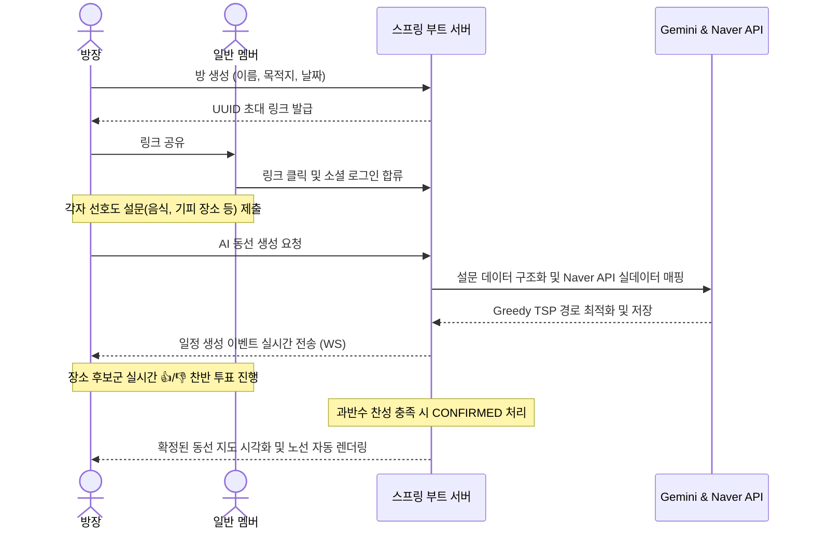

# WanderMap — 실시간 그룹 동선 플래너 ✈️

> "단톡방에 흩어지는 여행 핫플들, 수집하고 정리하기 머리 아프셨죠? 이제 WanderMap에서 친구들과 실시간으로 투표하고, AI의 지능적인 길 찾기 가이드와 함께 우리만의 특별한 여행 지도를 함께 그려보세요!"

WanderMap은 파편화된 여행지 정보와 멤버들의 다양한 취향을 취합하여, 실시간으로 동선을 조율하고 최적화해 주는 **그룹 동선 플래너** 서비스입니다.

---

## 📌 프로젝트 개요
수동으로 엑셀이나 카카오톡 메모에 동선을 기입하고 이동 시간을 찾아보던 비효율을 해결하기 위해 개발되었습니다. 
* **환각 없는 실데이터 기반**: AI(Gemini)는 멤버들의 요구사항을 정제하고 의도를 분석하는 역할로만 한정하고, 실제 장소 조회와 좌표 데이터 매핑은 네이버의 실데이터 검색 API를 사용하여 데이터 신뢰도를 100% 보장합니다.
* **실시간 동시성**: WebSocket(STOMP)을 통해 대기시간 없이 실시간으로 장소에 투표하고, 과반수 찬성 시 즉시 동선에 반영되는 부드러운 협업 경험을 선사합니다.

---

## 🛠️ 핵심 기능 소개

### 1. 3초 만에 끝나는 여행 방 생성 & 초대
* 로그인을 거쳐 여행 방을 바로 만들어보세요.
* 고유의 UUID 초대 링크를 발급해 드려요. 카카오톡이나 문자로 친구에게 보내면 즉시 같은 방에서 실시간으로 지도를 함께 보며 계획할 수 있습니다.

### 2. 눈치 보지 않는 개별 선호도 설문
* 맛집파, 카페파, 관광지파 등 각자의 선호도와 기피 키워드를 다른 멤버들의 답변에 구애받지 않고 프라이빗하게 제출합니다.
* 제출된 정보는 백엔드에서 취합하여 최적의 추천 코스를 만드는 원동력이 됩니다.

### 3. AI 기반의 똑똑한 동선 추천
* Gemini가 멤버들의 선호도를 지능적으로 구조화하여 분석합니다.
* 분석된 의도를 기반으로 네이버 API에서 실제 장소를 탐색하고, Greedy TSP 알고리즘을 사용해 이동 시간이 가장 짧은 도보/대중교통 최적화 경로를 지도에 선으로 이어 제공합니다.

### 4. 실시간 👍/👎 그룹 투표 및 동선 확정
* 후보 장소 카드가 실시간으로 공유됩니다.
* 멤버들이 실시간으로 👍 또는 👎로 투표하며 찬반이 과반수를 넘는 순간, 해당 장소는 확정 동선 타임라인에 즉시 반영되고 전체 브로드캐스트됩니다.

---

## 🗺️ 유저 플로우 (User Flow)



---

## 💾 데이터베이스 ERD (PostgreSQL)

WanderMap은 지리 정보 확장성 및 JSONB 인덱싱 효율을 위해 PostgreSQL을 사용합니다. 아래는 물리 테이블 관계의 상세 명세입니다.

```
+---------------+        +-------------------+        +---------------+
|     users     |        |   trip_members    |        |     trips     |
+---------------+        +-------------------+        +---------------+
| id (PK)       |<-------| trip_id (FK)      |------->| id (PK)       |
| email         |        | user_id (FK)      |        | invite_code   |
| nickname      |        | role (OWNER/MEMB) |        | title         |
| provider      |        +-------------------+        | destination   |
+---------------+                                     | start_date    |
        |                                             | status        |
        |                                             +---------------+
        |                                                     |
        |                                                     |
        |                                                     v
        |        +-------------------+        +-------------------+
        |        |    place_votes    |        |  itinerary_days   |
        |        +-------------------+        +-------------------+
        |------->| user_id (FK)      |        | id (PK)           |
                 | itinerary_pl (FK) |<---+   | trip_id (FK)      |
                 | vote_type (UP/DN) |    |   | day_number        |
                 +-------------------+    |   +-------------------+
                                          |             |
                                          |             |
                                          |             v
                 +-------------------+    |   +-------------------+
                 |      places       |    |   | itinerary_places  |
                 +-------------------+    |   +-------------------+
                 | id (PK)           |    |   | id (PK)           |
                 | naver_place_id    |<---+---| day_id (FK)       |
                 | name, address     |        | place_id (FK)     |
                 | latitude, longitud|        | visit_order       |
                 +-------------------+        | status (VOTING/..)|
                                              +-------------------+
```

---

## 🛠️ 기술 스택 (Tech Stack)

### 백엔드 (Backend)
* **Java 25** & **Spring Boot 4.1.0** (Virtual Threads 기반의 신속하고 안전한 실시간 웹소켓 STOMP 구현)
* **Spring Data JPA** & **QueryDSL** (동선 필터 및 캐시 관리)
* **PostgreSQL 16 (Supabase)** (로컬 개발 환경 일치를 위한 docker 컨테이너 사용)
* **Spring WebSocket** (그룹 실시간 투표 반영)
* **Gemini API** & **Naver Directions/Local API** (AI 구조화 및 경로 최적화)

### 프론트엔드 (Frontend)
* **Next.js 16.2.6** (App Router & React 19 호환)
* **TypeScript** & **Tailwind CSS v4** (일관성 있고 미려한 반응형 UI 스타일링)
* **Axios** (인터셉터 기반 통신 인스턴스)
* **Naver Maps JS SDK** (마커 diff 기반 최적화 렌더링)

---

## ⚡ 프로젝트 실행 방법

루트 폴더에 배치된 `Makefile`을 통해 모든 서비스를 원클릭으로 구동할 수 있습니다. 

### 사전 준비 사항
* 로컬 PC에 **Docker Desktop**이 설치되어 구동 중이어야 합니다.
* 패키지 매니저로 **pnpm**이 전역 설치되어 있어야 합니다. (`npm install -g pnpm`)

### 1. 인프라 컨테이너 구동 (PostgreSQL, Redis)
최초 1회 데이터베이스와 레디스 컨테이너를 백그라운드로 띄워줍니다.
```bash
make db
```

### 2. 백엔드 구동 (Spring Boot)
로컬 DB가 기동된 후, 백엔드 서버를 부트합니다. (이때 DDL 및 스키마가 PostgreSQL에 자동 로드됩니다.)
```bash
make back
```

### 3. 프론트엔드 구동 (Next.js)
의존성 패키지가 없는 경우 최초 실행 전에 `pnpm install`을 수행한 후 실행해 주세요.
```bash
make front
```

### 4. 한 번에 구동하기 (병렬 실행)
인프라 컨테이너 실행부터 백엔드 및 프론트엔드 개발 서버 기동까지 터미널 하나로 띄우고 싶다면 아래 명령어를 입력해 주세요.
```bash
make all
```

* **서비스 중지 (DB & Redis)**:
  ```bash
  make db-down
  ```
