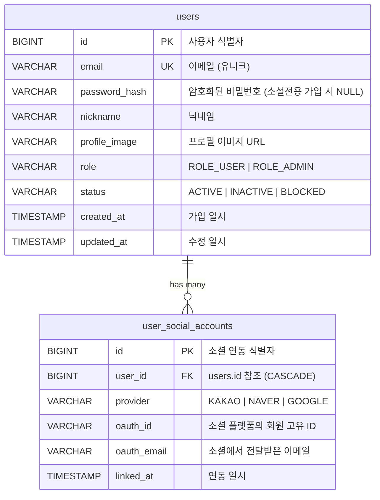

# WanderMap 인증 & OAuth 2.0 계정 통합 아키텍처 설계서

> **최근 수정일**: 2026-08-15  
> **문서 상태**: 설계 완료 (이메일 회원인증 우선 구현 예정)

본 문서는 WanderMap의 **일반 이메일/비밀번호 인증**과 **OAuth 2.0 소셜 로그인 3종(카카오, 네이버, 구글)**의 통합 설계 및 **동일 이메일 기반 계정 연동(Account Linking)**을 위한 데이터베이스 모델링, API 발급/시크릿 관리 파이프라인을 다룹니다.

---

## 📌 1. 핵심 요구사항 및 단계별 개발 로드맵

```
[Phase 1: 이메일 기반 인증 (우선 구현)] ──▶ [Phase 2: 계정 연동 DB 리팩토링] ──▶ [Phase 3: OAuth 3사 연동]
- 회원가입 (BCrypt 암호화)              - user_social_accounts 분리        - Kakao / Naver / Google Client
- 이메일/비밀번호 로그인               - 동일 이메일 자동/수동 연동 로직    - CustomOAuth2UserService
- JWT 토큰 (Access + Refresh) 발급                                        - GitHub Actions Secrets 연동
```

1. **1단계 (차기 우선 구현 대상)**: 일반 이메일/비밀번호 회원가입 및 로그인 (JWT 토큰 발급/검증)
2. **2단계**: 동일 이메일 감지 시 기존 계정으로 소셜 계정을 병합/연동하는 계정 통합(Account Linking) 구조 구축
3. **3단계**: 카카오, 네이버, 구글 OAuth 2.0 공식 API 연동 및 자동 로그인 연계

---

## 🗄️ 2. 동일 이메일 계정 통합을 위한 데이터베이스 설계

### 2.1 기존 단일 테이블의 한계점
기존 `users` 테이블에 `provider`와 `oauth_id`가 1:1 컬럼으로 존재할 경우, A라는 사용자가 이메일(`user@example.com`)로 가입한 후 동일한 이메일의 카카오나 구글로 로그인하면 **기존 계정 레코드에 덮어쓰거나 중복 생성 오류**가 발생합니다.

### 2.2 해결책: 1:N 소셜 계정 분리 모델 (ERD)

핵심 유저 마스터(`users`)와 소셜 연동 정보(`user_social_accounts`)를 1:N 관계로 분리합니다.



### 2.3 PostgreSQL DDL 스키마

```sql
-- 1. 사용자 마스터 테이블 (이메일 및 로컬 비밀번호 관리)
CREATE TABLE IF NOT EXISTS users (
    id            BIGSERIAL PRIMARY KEY,
    email         VARCHAR(255) UNIQUE NOT NULL,
    password_hash VARCHAR(255),               -- 이메일 회원은 필수, 소셜 전용 회원은 NULL 허용
    nickname      VARCHAR(50)  NOT NULL,
    profile_image VARCHAR(500),
    role          VARCHAR(20)  DEFAULT 'ROLE_USER' NOT NULL,
    status        VARCHAR(20)  DEFAULT 'ACTIVE' NOT NULL,
    created_at    TIMESTAMP    DEFAULT NOW() NOT NULL,
    updated_at    TIMESTAMP    DEFAULT NOW() NOT NULL
);

-- 2. 소셜 계정 연동 테이블 (1:N 매핑)
CREATE TABLE IF NOT EXISTS user_social_accounts (
    id            BIGSERIAL PRIMARY KEY,
    user_id       BIGINT NOT NULL REFERENCES users(id) ON DELETE CASCADE,
    provider      VARCHAR(20) NOT NULL,       -- 'KAKAO' | 'NAVER' | 'GOOGLE'
    oauth_id      VARCHAR(255) NOT NULL,      -- 각 플랫폼의 고유 ID (sub / id)
    oauth_email   VARCHAR(255),               -- 플랫폼에서 제공한 이메일 (참고용)
    linked_at     TIMESTAMP DEFAULT NOW() NOT NULL,
    UNIQUE (provider, oauth_id)               -- 동일 플랫폼의 동일 소셜ID는 1건만 존재
);

CREATE INDEX IF NOT EXISTS idx_social_user_id ON user_social_accounts(user_id);
CREATE INDEX IF NOT EXISTS idx_social_provider_oauth ON user_social_accounts(provider, oauth_id);
```

---

## 🔄 3. 계정 통합(Account Linking) 시나리오 & 비즈니스 로직

사용자가 어떤 방식으로 접근하든 **동일한 `users.id`로 통합**되어 모든 여행 방, 선호도 설문, 투표 내역이 그대로 유지됩니다.

```
                  [사용자 로그인 요청]
                           │
         ┌─────────────────┴─────────────────┐
         ▼                                   ▼
 [이메일 + 비밀번호 로그인]              [OAuth 소셜 간편 로그인]
         │                                   │
         ▼                                   ▼
  비밀번호 일치 검증                OAuth ID / Email 획득
         │                                   │
         ▼                         ┌─────────┴─────────┐
    JWT 토큰 발급                  ▼                   ▼
                           [연동 이력 존재?]    [연동 이력 없음]
                                   │                   │
                                   ▼                   ▼
                           기존 User로 로그인     동일 Email의 User 검색
                                                       │
                                            ┌──────────┴──────────┐
                                            ▼                     ▼
                                     [기존 User 존재]      [완전 신규 유저]
                                            │                     │
                                            ▼                     ▼
                                    기존 User에 소셜 연동   신규 User + 소셜 생성
                                            │                     │
                                            └──────────┬──────────┘
                                                       ▼
                                                 JWT 토큰 발급
```

### 3.1 시나리오 A: 이메일 가입 유저가 추후 동일 이메일의 소셜로 로그인한 경우
1. A 유저가 `user@test.com` / `비밀번호1234`로 회원가입 (`users.id = 1`).
2. 며칠 뒤 A 유저가 **카카오 로그인**을 클릭 (`oauth_email: "user@test.com"`, `oauth_id: "kakao_98765"`).
3. 백엔드 `OAuth2UserService`에서 `user_social_accounts`를 조회 ➜ 없음.
4. `users` 테이블에서 `email = "user@test.com"`을 조회 ➜ **`users.id = 1` 발견!**
5. `user_social_accounts`에 `(user_id: 1, provider: 'KAKAO', oauth_id: 'kakao_98765')` 행을 자동 INSERT (계정 연동).
6. 최종적으로 `users.id = 1` 기준의 JWT Access/Refresh Token을 발급하여 로그인 성공.
7. ➜ **결과**: 이메일로 로그인하든, 카카오로 로그인하든 동일한 `users.id = 1`로 인식되어 기존 여행 데이터 완벽 보존.

### 3.2 시나리오 B: 소셜 가입 유저가 추후 동일 이메일로 일반 로그인하려는 경우
1. 소셜 로그인으로 최초 가입 (`password_hash = NULL`).
2. 나중에 이메일/비밀번호 폼으로 로그인을 시도하면 "소셜 로그인으로 가입된 계정입니다. 소셜 로그인을 이용하시거나 비밀번호를 설정해 주세요." 안내.
3. 마이페이지 또는 비밀번호 설정 메뉴에서 비밀번호를 등록하면 `password_hash`가 채워져 양방향 로그인 모두 가능.

---

## 🔑 4. OAuth 3사 API 발급 및 설정 가이드

### 4.1 🟡 카카오 (Kakao Developers)
1. [Kakao Developers 콘솔](https://developers.kakao.com/) 접속 ➜ **내 애플리케이션 추가**.
2. **앱 키** 확인: `REST API 키` (Spring의 `client-id`로 사용).
3. **플랫폼 설정**:
   - Web 플랫폼 등록: `http://localhost:3000`, `http://localhost:8080`
   - Redirect URI 등록: `http://localhost:8080/login/oauth2/code/kakao`
4. **카카오 로그인 활성화**: ON 설정.
5. **동의항목 설정**:
   - 닉네임 (필수), 프로필 사진 (선택), 카카오계정 이메일 (필수 또는 선택).
6. **보안 설정**: `Client Secret` 코드 생성 및 활성화.

---

### 4.2 🟢 네이버 (Naver Developers)
1. [Naver Developers 콘솔](https://developers.naver.com/apps/#/register) 접속 ➜ **Application 등록**.
2. **사용 API**: `네이버 로그인` 선택.
3. **제공 항목**: 회원이름, 이메일, 프로필사진, 닉네임.
4. **서비스 환경 (PC웹)**:
   - 서비스 URL: `http://localhost:3000`
   - 네이버 로그인 Callback URL: `http://localhost:8080/login/oauth2/code/naver`
5. **Client ID** 및 **Client Secret** 발급 확인.

---

### 4.3 🔵 구글 (Google Cloud Console)
1. [Google Cloud Console](https://console.cloud.google.com/) 접속 ➜ 프로젝트 생성.
2. **API 및 서비스** ➜ **OAuth 동의 화면** 구성 (User Type: 외부, 앱 이름/이메일 입력).
3. **사용자 인증 정보** ➜ **OAuth 2.0 클라이언트 ID 만들기**:
   - 애플리케이션 유형: `웹 애플리케이션`
   - 승인된 자바스크립트 원본: `http://localhost:3000`, `http://localhost:8080`
   - 승인된 리디렉션 URI: `http://localhost:8080/login/oauth2/code/google`
4. **Client ID** 및 **Client Secret** 발급 확인.

---

## 🛡️ 5. API Key & Secret 관리 파이프라인 (GitHub Actions)

보안 키(Client Secret, JWT Secret 등)는 절대 코드 저장소(Git)에 하드코딩하지 않고, **환경 변수 주입 방식**으로 관리합니다.

### 5.1 스프링 부트 `application.yml` 환경변수 매핑

```yaml
spring:
  security:
    oauth2:
      client:
        registration:
          google:
            client-id: ${GOOGLE_CLIENT_ID}
            client-secret: ${GOOGLE_CLIENT_SECRET}
            scope:
              - profile
              - email
          kakao:
            client-id: ${KAKAO_CLIENT_ID}
            client-secret: ${KAKAO_CLIENT_SECRET}
            client-authentication-method: client_secret_post
            authorization-grant-type: authorization_code
            redirect-uri: "{baseUrl}/login/oauth2/code/{registrationId}"
            scope:
              - profile_nickname
              - profile_image
              - account_email
          naver:
            client-id: ${NAVER_CLIENT_ID}
            client-secret: ${NAVER_CLIENT_SECRET}
            authorization-grant-type: authorization_code
            redirect-uri: "{baseUrl}/login/oauth2/code/{registrationId}"
            scope:
              - name
              - email
              - profile_image
        provider:
          kakao:
            authorization-uri: https://kauth.kakao.com/oauth/authorize
            token-uri: https://kauth.kakao.com/oauth/token
            user-info-uri: https://kapi.kakao.com/v2/user/me
            user-name-attribute: id
          naver:
            authorization-uri: https://nid.naver.com/oauth2.0/authorize
            token-uri: https://nid.naver.com/oauth2.0/token
            user-info-uri: https://openapi.naver.com/v1/nid/me
            user-name-attribute: response

jwt:
  secret: ${JWT_SECRET_KEY:default-local-dev-secret-key-must-be-very-long-32bytes}
  access-token-expiration: 3600000    # 1시간
  refresh-token-expiration: 604800000 # 7일
```

### 5.2 GitHub Actions Secrets & CI/CD 연동

1. **GitHub Repository Settings** ➜ **Secrets and variables** ➜ **Actions**로 이동.
2. 아래 시크릿 키들을 `New repository secret`으로 등록:
   - `KAKAO_CLIENT_ID`, `KAKAO_CLIENT_SECRET`
   - `NAVER_CLIENT_ID`, `NAVER_CLIENT_SECRET`
   - `GOOGLE_CLIENT_ID`, `GOOGLE_CLIENT_SECRET`
   - `JWT_SECRET_KEY`
   - `PROD_DB_URL`, `PROD_DB_USERNAME`, `PROD_DB_PASSWORD`

3. **GitHub Actions 배포 워크플로우 (`.github/workflows/deploy.yml`) 예시**:

```yaml
name: Backend CI/CD Pipeline

on:
  push:
    branches: [ "main" ]

jobs:
  build-and-deploy:
    runs-on: ubuntu-latest
    steps:
      - uses: actions/checkout@v4

      - name: Set up JDK 17
        uses: actions/setup-java@v4
        with:
          java-version: '17'
          distribution: 'temurin'

      - name: Build with Gradle
        env:
          KAKAO_CLIENT_ID: ${{ secrets.KAKAO_CLIENT_ID }}
          KAKAO_CLIENT_SECRET: ${{ secrets.KAKAO_CLIENT_SECRET }}
          NAVER_CLIENT_ID: ${{ secrets.NAVER_CLIENT_ID }}
          NAVER_CLIENT_SECRET: ${{ secrets.NAVER_CLIENT_SECRET }}
          GOOGLE_CLIENT_ID: ${{ secrets.GOOGLE_CLIENT_ID }}
          GOOGLE_CLIENT_SECRET: ${{ secrets.GOOGLE_CLIENT_SECRET }}
          JWT_SECRET_KEY: ${{ secrets.JWT_SECRET_KEY }}
        run: |
          cd backend
          chmod +x ./gradlew
          ./gradlew build -x test
```

### 5.3 로컬 개발용 시크릿 관리 (`.env` 또는 로컬 환경변수)
* `backend/src/main/resources/application-local.yml`을 만들어 `.gitignore`에 등록하거나,
* 개발 툴(IntelliJ IDEA / VS Code / Antigravity)의 Run Configuration 환경변수에 값을 주입하여 로컬에서 안전하게 테스트합니다.

---

## 🚀 6. 다음 구현 단계 체크리스트

- [ ] **Step 1: 일반 이메일 인증 구현**
  - `BCryptPasswordEncoder` 빈 등록
  - `UserRegisterRequest`, `UserLoginRequest` DTO
  - `AuthService` 회원가입(비밀번호 해시화) 및 로그인 로직
  - `JwtTokenProvider` (Access/Refresh Token 생성 및 파싱)
  - `AuthController` (`POST /api/auth/register`, `POST /api/auth/login`)
- [ ] **Step 2: 계정 연동(Account Linking) DB 분리**
  - `User` 엔티티 수정 (`passwordHash` 추가, provider 필드 분리)
  - `UserSocialAccount` 엔티티 및 Repository 구현
- [ ] **Step 3: OAuth 2.0 3사 Client 연동**
  - `CustomOAuth2UserService` 및 `OAuth2UserInfo` 팩토리 구현 (Kakao, Naver, Google 파싱)
  - `OAuth2SuccessHandler` (소셜 로그인 성공 시 동일 이메일 연동 처리 및 프론트엔드로 JWT 토큰 리다이렉트)
